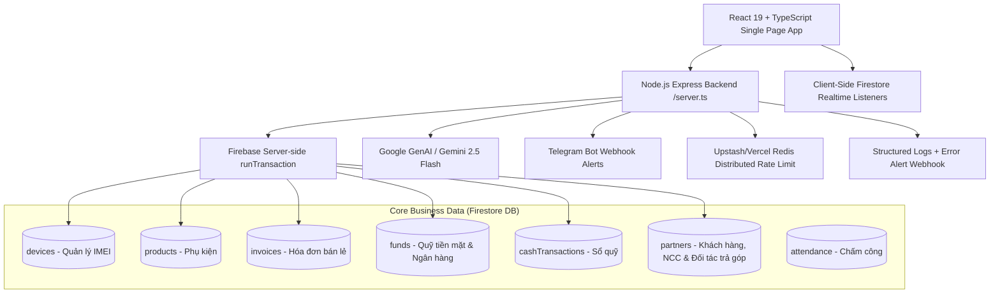

# Kiến Trúc Hiện Tại (Current State Architecture) - PhoneHouse CRM

**Phiên bản Baseline**: Production Hardening Phase 2 — 2026-08-30
**Trạng thái**: Modular monolith đang vận hành trên Vercel, Firebase Auth/Firestore và server-authoritative APIs.

---

## 1. Sơ Đồ Khối Hệ Thống Hiện Tại

---

## 2. Các Đạt Được Hiện Tại
- **POS Atomic Checkout**: Gọi qua `POST /api/pos/checkout`, xử lý bằng `runTransaction()` chống bán trùng IMEI, chống trừ âm phụ kiện, xử lý Idempotency Key.
- **Kế toán Quỹ & Trả góp**: Nợ công ty tài chính tách bạch riêng biệt với Khách hàng; Phiếu thu gắn `fundId` tường minh, hóa đơn lưu `paymentFundId`.
- **Chấm công 3 lớp**: Face ID AI, GPS kiểm tra bán kính thực tế, Mạng cửa hàng qua Server Egress Public IP `/api/attendance/network-check`. Khóa giờ server và khóa check-in trùng.
- **Firestore Security Rules**: Role-based access control có điều kiện `canAccessBranch(branchId)` và cập nhật ràng buộc `AND` giữa chi nhánh nguồn/đích.
- **Vòng đời xác thực**: Firebase UID phải có hồ sơ `users/{uid}` đang hoạt động; tài khoản có `mustChangePassword=true` bị chặn ở cả API và Firestore Rules cho tới khi đổi mật khẩu qua luồng tái xác thực gần nhất.
- **Production perimeter**: CSP/security headers áp dụng cho SPA và API; App Check có thể bật cưỡng chế sau khi cấu hình reCAPTCHA site key.
- **Operational resilience**: `/api/health`, `/api/ready`, production verification script, structured client/server error intake và Firestore export runbook.

---

## 3. Các Điểm Cần Nâng Cấp Tiếp Theo (Target Roadmap)
- Tách tiếp các view/service trên 2.000 dòng thành feature module, hook và use-case nhỏ.
- Di chuyển các Firestore realtime read còn lại sang API có scope/phân trang khi không thực sự cần realtime.
- Cấu hình tài nguyên production bên ngoài code: Redis REST, App Check enforcement, error-alert destination và lịch backup tự động.
- Hoàn thành UAT phần in K80, responsive, bảo hành, CRM SLA và ma trận phân quyền.
