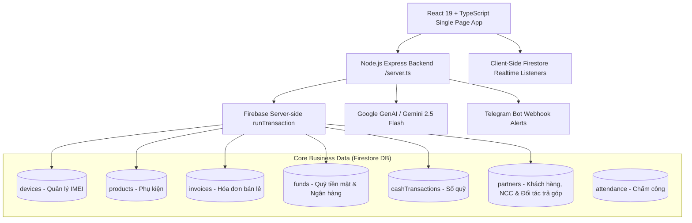

# Kiến Trúc Hiện Tại (Current State Architecture) - PhoneHouse CRM

**Phiên bản Baseline**: Commit `04c10e8` (Post-Hardening Production Baseline)  
**Trạng thái**: Đã giải quyết toàn bộ lỗ hổng Critical P0/P1, sẵn sàng tiến vào lộ trình 5 Releases chuẩn Enterprise.

---

## 1. Sơ Đồ Khối Hệ Thống Hiện Tại

---

## 2. Các Đạt Được Hiện Tại
- **POS Atomic Checkout**: Gọi qua `POST /api/pos/checkout`, xử lý bằng `runTransaction()` chống bán trùng IMEI, chống trừ âm phụ kiện, xử lý Idempotency Key.
- **Kế toán Quỹ & Trả góp**: Nợ công ty tài chính tách bạch riêng biệt với Khách hàng; Phiếu thu gắn `fundId` tường minh, hóa đơn lưu `paymentFundId`.
- **Chấm công 3 lớp**: Face ID AI, GPS kiểm tra bán kính thực tế, Mạng cửa hàng qua Server Egress Public IP `/api/attendance/network-check`. Khóa giờ server và khóa check-in trùng.
- **Firestore Security Rules**: Role-based access control có điều kiện `canAccessBranch(branchId)` và cập nhật ràng buộc `AND` giữa chi nhánh nguồn/đích.

---

## 3. Các Điểm Cần Nâng Cấp Tiếp Theo (Target Roadmap)
- Tách tầng backend thành các route module độc lập (`server/routes/`, `server/services/`).
- Chuẩn hóa Design System tokens (`src/shared/ui/`).
- Chuyển giao các module lớn sang Kanban & 360° View (CRM, Warranty, Finance Banking).
