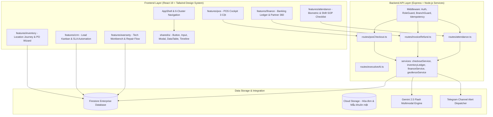

# Kiến Trúc Mục Tiêu (Target State Architecture) - PhoneHouse CRM

**Mục tiêu**: Chuẩn hóa hệ thống quản trị bán lẻ chuỗi theo mô hình Enterprise Modular Monolith / SaaS Ready.

---

## 1. Kiến Trúc Phân Lớp Mục Tiêu (Target Modular Architecture)

---

## 2. Các Quy Chuẩn Nghiệp Vụ Bất Biến (Invariant Principles)
1. **Single Writer Pattern**: Các nghiệp vụ tác động đa collection (Bán hàng, Đổi trả, Chuyển quỹ, Nhập hàng) bắt buộc qua Server Transaction API.
2. **Strict Partner Accounting**:
   - `CUSTOMER`: Chỉ tăng `totalSpent`. Công nợ luôn = 0 đối với đơn trả góp tài chính.
   - `FINANCE_PARTNER`: Ghi nhận toàn bộ khoản giải ngân trả góp chưa thanh toán (`outstandingDebt`).
   - `SUPPLIER`: Khớp chính xác `supplierId` khi trả nợ, không dùng fallback.
3. **Traceable Inventory Lifecycle**:
   - Mỗi máy có định danh `IMEI` (15 số thực tế), lưu trữ vết chuyển kho `stockMovements` và `LocationBadge`.
4. **Biometric & Network Attendance**:
   - Mốc thời gian lấy theo giờ server, xác thực Egress IP chi nhánh và không cho client tự gán `SUCCESS` khi máy chủ AI offline.
